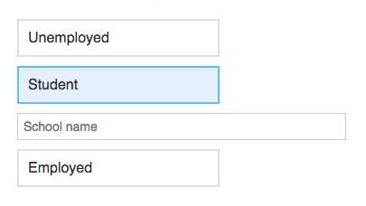

# Week 2

This week we will begin our journey by looking at some of the complexities related to user interface programming, and how React removes some of these obstacles.

## Monday

Today we will talk about the complexity of developing user interfaces. We will do this by creating a small user interfaces in three different versions: One in pure JavaScript and HTML, one with a slightly different approach in JavaScript, and then in React. These three examples are below, and the problems associated to each approach can be found in their README's.

### A UI Complexity Problem

This is the user interface that we will build. It has three buttons, and two input fields that toggle depending on the users' selections.

1. **[ui-complexity-dom-manipulation](ui-complexity-dom-manipulation)**. A simple user interface written in pure JavaScript. Please consult the README.

1. **[ui-complexity-render-function](ui-complexity-render-function)**. The same user interface written to render HTML elements in JavaScript. Please consult the README.

### Solving it with React

We will now code this interface in React using a lot of techniques that will seem unfamiliar. We will discuss these things in the coming weeks. For now, it's just a matter of understanding what React _does_.

1. **[ui-complexity-react](ui-complexity-react)**. The same user interface written in React. Please consult the README.

### Installing `create-react-app`

To get started with React, you first need to install `create-react-app`.

1. First make sure that you are running the [latest version of Node.js](https://nodejs.org/en/).
1. Run `npm install -g create-react-app` from your terminal. If you're getting an error, try running `sudo npm install -g create-react-app`.

Now you are ready to generate a React application.

1. `cd` into your class folder. For me, this would be `cd ~/Documents/reactive-user-interfaces`.
1. Run `create-react-app test-project`. In this case `test-project` will be the name of the folder with the application.
1. When it is done installing, run `cd test-project` and then `npm start` to see the app in your browser.

### Assignment for Wednesday

If you haven't already, follow the instructions from above to install `create-react-app`. Generate a new app inside of your class repository, and run it with `npm start` so you can see it in your browser. You do not need to write any code. Commit the project to your class repository and push it to GitHub. I recommend using [GitHub Desktop](https://desktop.github.com/) for this.

## Wednesday

### Introduction to the `create-react-app` project skeleton

### Components

The `Component` class is fundamental to any project using React. Let us look at some of the basic component concepts, as demonstrated in [The official React guide to components](https://reactjs.org/docs/components-and-props.html).

1. **[components](components)**. This demonstrates the basic functionality of a React component. Please consult the README.

### JSX

Understanding the JSX templating language is important. Let us look at the JSX syntax, as demonstrated in [The official React guide to JSX](https://reactjs.org/docs/introducing-jsx.html).

1. **[jsx](jsx)**. This takes a deeper look at the JSX syntax that makes React components so powerful.

### React Developer Tools

Let us [install](https://github.com/facebook/react-devtools) and use them!
