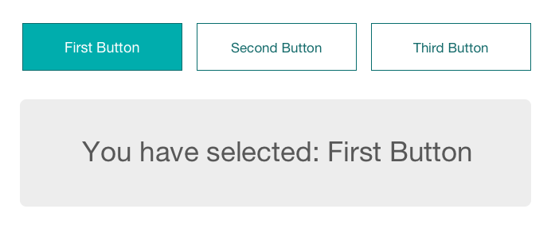

# Week 3

This week we will continue our journey into React by looking at state and event handling.

## Monday

### Homework

* **[homework](homework)**. A simple implementation of The New York Times Business section article listing.

### Component State

React documentation: [State and Lifecycle](https://reactjs.org/docs/state-and-lifecycle.html).

* **[component-state](component-state)**. A simple example to demonstrate component state.

Now build your own counter in class!

### Assignment for Wednesday

* Re-visit today's homework: Look at the solution provided in class and see if you can simplify your own code. Remember to commit and push your changes to GitHub.

## Wednesday

### Events

React documentation: [Handling Events](https://reactjs.org/docs/handling-events.html).

* **[event-handling](event-handling)**. Demonstrates communication between two components via their parent.

* **[dynamic-components](dynamic-components)**. Demonstrates how to create many components from an array.

### Assignment for Monday

For Monday, you need to build the following user interface in React.js:

Each button needs to be clickable, and this should update the component below as well as highlight the current selected button. Take a look at the design, and sketch out a component architecture that makes sense for this. Push your code to GitHub and write up a short blog post describing your process.
