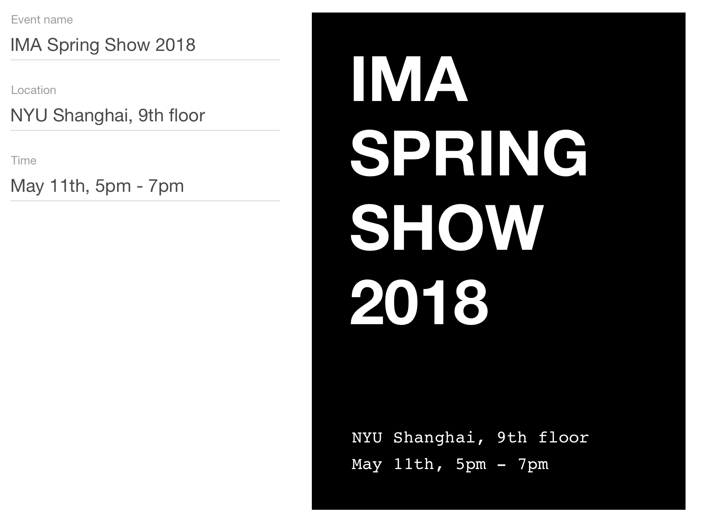

# Week 4

## Monday

### Homework

* **[homework](homework)**. The solution to this week's homework.

### Dynamic Components

React documentation: [Lists and Keys](https://reactjs.org/docs/lists-and-keys.html).

* **[dynamic-components](dynamic-components)**. A code example creating dynamic components
* **[homework-dynamic-components](homework-dynamic-components)**. This week's homework with dynamic components.

### Assignment for Wednesday

* Take another look at your homework. If you didn't manage to get the active buttons working, fix it. If you managed to get the whole app working, re-write it to use dynamic components. Make your changes to the same application and push to GitHub.

## Wednesday

### Form components

* **[form-inputs](form-inputs)**. A code example to demonstrate how to use state with form inputs.

### Lifting State up

* **[temperature-converter](temperature-converter)**. A code example to demonstrate how to lift state up to the closest common ancestor.

### Assignment for Monday

For Monday, re-create this user interface.

The user should be able to update the input fields on the left and see the poster on the right update dynamically. All typography uses Helvetica, except two lines in the poster set in Courier.
